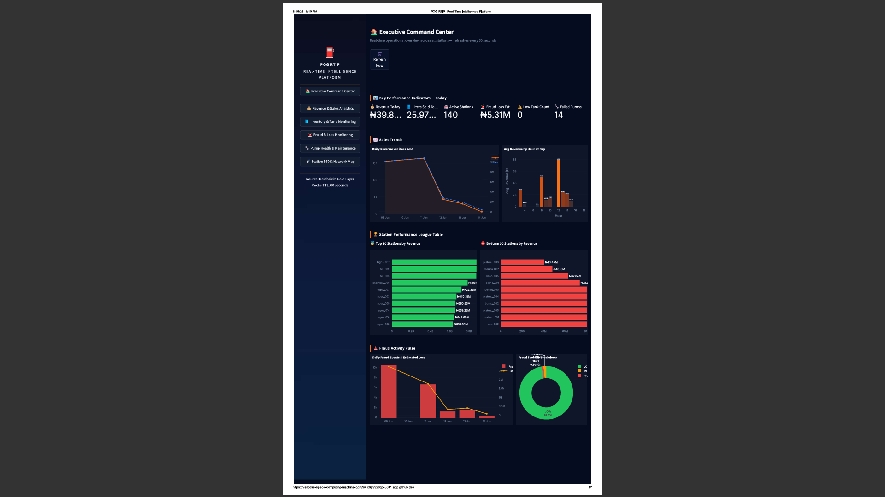
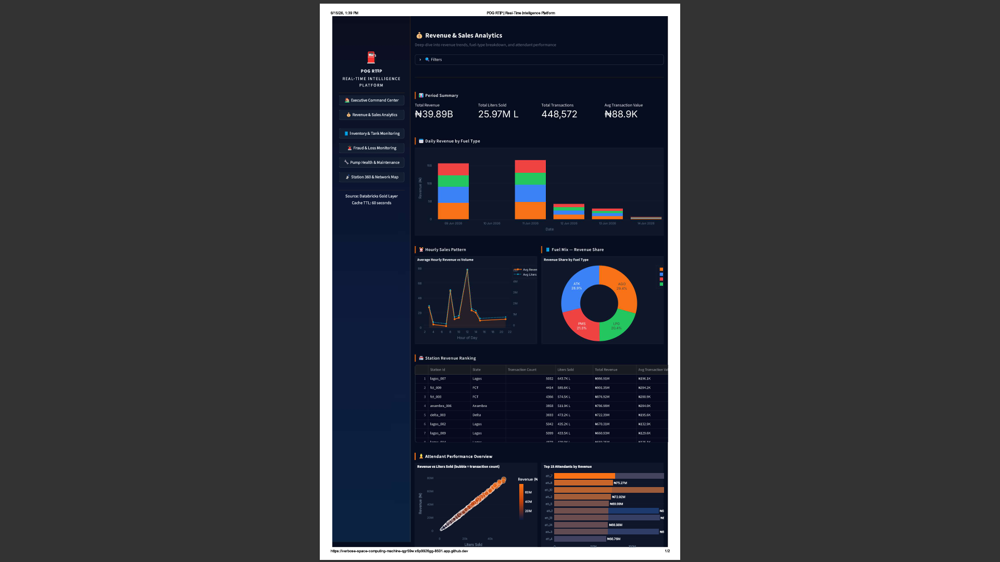
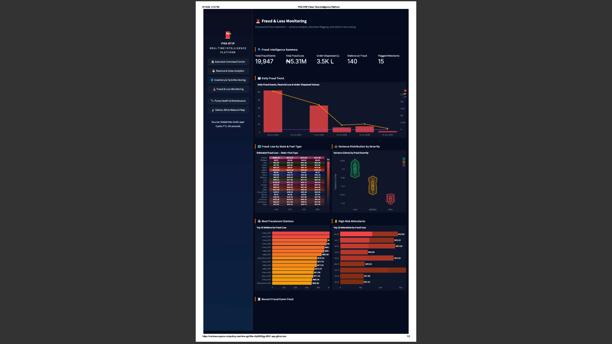
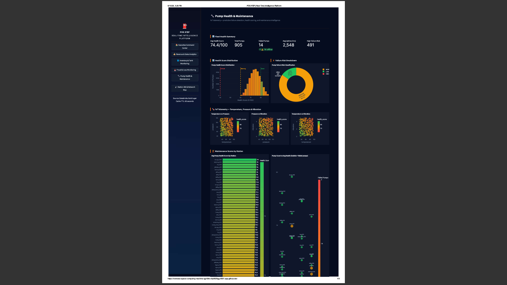

# Paul Oil & Gas Real-Time Intelligence Platform (POG-RTIP)

> Production-grade real-time data engineering platform simulating operational intelligence across 140 fuel stations in 20 Nigerian states.


---

## Overview

POG-RTIP is an end-to-end enterprise data engineering platform built to simulate how large-scale fuel retail companies process operational telemetry, detect fraud in real time, orchestrate batch pipelines, and serve analytics dashboards.

The system combines both **streaming** and **batch** architectures to process high-frequency industrial events across a distributed fuel station network.

### Core Capabilities

- Real-time event streaming
- Fraud anomaly detection
- Industrial telemetry processing
- Fuel inventory monitoring
- Pump health monitoring
- Executive operational dashboards
- Batch orchestration pipelines
- Medallion data architecture

---

## Architecture

```text
Python Simulators
      │
      ▼
Redpanda (Kafka)
      │
      ▼
Apache Flink
      │
      ├────────────► ClickHouse
      │              (Real-Time Analytics DB)
      │
      ▼
MinIO Object Storage
      │
      ▼
Dagster Orchestration
      │
      ▼
Databricks Warehouse
      │
      ▼
dbt Transformation Layer

Bronze → Silver → Gold

      │
      ▼
Streamlit Dashboards


Monitoring Stack

Docker → Prometheus → Grafana
```

---

## Tech Stack

| Layer | Technology |
|---------|------------|
| Streaming | Redpanda |
| Processing | Apache Flink |
| Operational DB | ClickHouse |
| Object Storage | MinIO |
| Orchestration | Dagster |
| Warehouse | Databricks |
| Transformation | dbt |
| Monitoring | Grafana + Prometheus |
| Dashboard | Streamlit |
| Infrastructure | Docker |

---

## Data Pipeline

The platform uses a hybrid architecture.

### Real-Time Layer

- Python generators simulate fuel station telemetry
- Events stream into Redpanda
- Apache Flink processes live data
- Processed data flows directly into ClickHouse for real-time querying

### Batch Layer

- Processed events are persisted into MinIO
- Dagster detects new objects
- Dagster loads raw data into Databricks
- dbt transforms warehouse data through Bronze → Silver → Gold architecture

---

## Project Scale

- 140 Fuel Stations
- 20 Nigerian States
- Continuous Event Streams
- Real-Time Fraud Detection
- Operational Analytics Infrastructure

---

## dbt Models

### Bronze

- bronze_dim_stations
- bronze_pump_transactions
- bronze_fuel_deliveries
- bronze_pump_health
- bronze_tank_readings

### Silver

- silver_sales
- silver_inventory
- silver_pump_health
- silver_stations
- silver_fraud

### Gold

- gold_executive_command_center
- gold_failure_risk
- gold_fraud_events
- gold_fraud_losses
- gold_station_revenue
- gold_tank_utilization
- gold_sales_daily
- gold_sales_hourly

---

## Monitoring Infrastructure

Infrastructure observability powered by:

- Grafana
- Prometheus
- Docker monitoring

---

## Streamlit Dashboards

### Executive Dashboard



### Revenue Dashboard



### Fraud Dashboard



### Pump Health Dashboard



---

## Repository Structure

```bash
simulator/
orchestration/
dbt/
flink-jobs/
streamlit_app/
infrastructure/
assets/
```

---

## Engineering Concepts Demonstrated

- Distributed Systems Design
- Event Driven Architecture
- Real-Time Stream Processing
- Kafka Event Streaming
- ETL/ELT Pipeline Design
- Data Warehouse Modeling
- Batch Pipeline Orchestration
- Fraud Detection Systems
- Operational Analytics Engineering
- Containerized Infrastructure

---

## Local Setup

Clone repository

```bash
git clone <repo-url>
```

Run infrastructure

```bash
docker compose up -d
```

Run dbt

```bash
dbt run
```

Run dashboard

```bash
streamlit run app.py
```

---

## Why This Project Matters

This project simulates the exact type of architecture used in modern enterprise environments where organizations must process high-frequency operational data in real time while simultaneously maintaining analytical warehouses for business intelligence workloads.

---

## Author

Paul ETL

Data Engineering | Distributed Systems | Real-Time Analytics | Infrastructure Engineering
